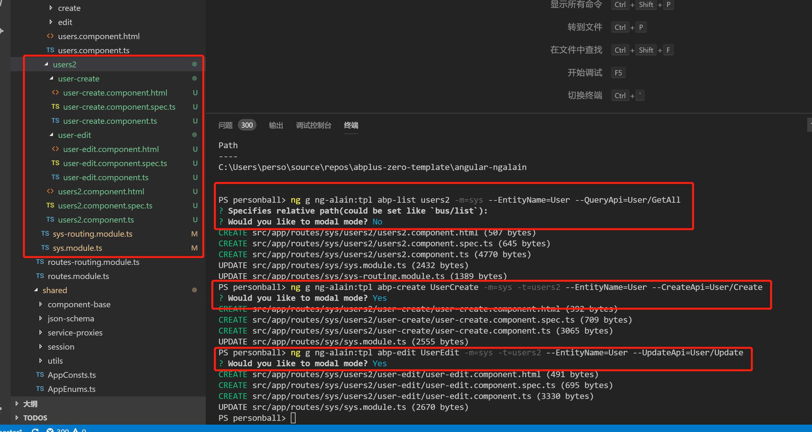

# abplus-zero-template
A Startup Project Template

# 使用方式

  abplus init Abplus.ZeroDemo -T personball/abplus-zero-template -t ng
  
  [abplus命令说明](https://github.com/personball/Abp-CLI)

# 说明

基于4.3.0版[aspnetboilerplate/module-zero-core-template](https://github.com/aspnetboilerplate/module-zero-core-template)的项目模板修改而来，主要有以下变更：

1. 升级asp.net core 到2.2版
1. 升级ef core 到2.2版
1. 集成NLog替换log4net
1. 实现业务异常和错误码以及错误提示本地化机制，[详情参考](https://personball.com/abp/2017/08/28/abp-error-code-design)
1. 配置swagger ui使用程序集xml以便在线api文档显示注释
1. swagger endpoint改为相对路径
1. 添加一个MemberUser对象继承于User，并为之配置TPH关系
1. 升级ef core 2.2后，在EntityFrameworkCore程序集下新增`AbpProjectNameEntityTypeConfiguration<T>`基类，并启用自动发现并应用继承该基类的实体配置类
1. 默认连接字符串改为使用本地localdb

# vue说明

[vue项目启动说明](https://github.com/personball/abplus-zero-template/tree/master/vue)

# angular说明

基于[ng-alain](https://ng-alain.com/docs/getting-started/zh)前端框架，集成abp。完整保留ng-alain的开发体验。

## ng-alain 脚手架及自定义页面模板增强

ng-alain基于angular脚手架机制扩展了一套脚手架方便简单需求CRUD的快速开发，同时开放了自定义模板机制，自定义模板放置于'_cli-tpl'目录下, 通过命令`ng g ng-alain:tpl templateName ...`进行调用。  

本项目模板基于ng-alain的自定义模板，通过[delon issue409](https://github.com/ng-alain/delon/issues/409)的_fix.js扩展点，通过解析后端（aspnet-core目录中的api Host项目）接口的Swagger.json类型信息定义，实现根据后端ABP项目接口定义生成相应的列表页（abp-list），创建Modal(abp-create),编辑Modal(abp-edit)。以避免手动从零开始编写SFSchema和STColumns的定义。

如图示例：

[ng-alain使用说明](https://github.com/personball/abplus-zero-template/tree/master/angular)

## 参考

* [ng-alain](https://ng-alain.com/docs/getting-started/zh)
* [52ABP/YoyoCms](https://github.com/52ABP/LTMCompanyNameFree.YoyoCmsTemplate)

# MIT
